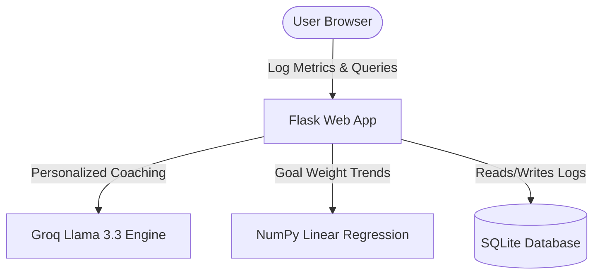

# 🏋️‍♂️ FitAI — Premium AI Fitness Coach & Health Analytics Platform

FitAI is a premium, full-stack health tracking and AI-driven coaching platform. It features interactive analytics dashboards, automated workout and dietary recommendations, custom goal-tracking predictions, and robust data export tools.

Built with **Flask**, **SQLite**, **Bcrypt**, **Plotly**, **Pandas**, **NumPy**, and the **Groq API** (Llama 3.3).

---

## ✨ Features

* **🤖 AI Fitness Coach:** Instant personalized single-session workouts, meal planners, and structured multi-week programs (Muscle Gain, Shred, Gym, Home) tailored to your age, weight, height, activity level, and dietary preferences.
* **📈 Rich Interactive Analytics:** 10 dark-themed Plotly charts tracking weight trends, daily steps, water intake, sleep quality, workout duration, and calorie balances.
* **🔮 NumPy Goal Forecasting:** A linear regression model that calculates weight progress trends and predicts the target date you will reach your goal.
* **🛡️ Security & Authentication:** Secure registration and login using either **Username or Email**, with bcrypt-hashed password security.
* **📥 Data Portability:** Download full raw history data as CSV files, or generate a diagnostic plain-text health report.
* **📱 Premium Responsive Design:** High-fidelity dark mode with glassmorphism layout, customized circular icons, and floating gradient orbs optimized for both desktop and mobile screens.

---

## 📐 System Architecture & Workflow

FitAI uses a clean layout linking the Flask backend, SQLite database, NumPy forecasting logic, and the Groq AI engine:



### Core Workflow
1. **Data Tracking**: Users log daily health metrics (weight, steps, sleep, water, calories, workouts) which write directly to the persistent SQLite database.
2. **Contextual AI Coach**: The AI Coach loads the user's custom biometric profile and queries Llama 3.3 via the Groq API to return tailored diet and workout plans.
3. **Linear Regression Forecasts**: The analytics system runs regression algorithms on weight history logs to predict the exact date the goal weight is met.

---

## 🛠️ Technology Stack

* **Backend:** Python / Flask
* **Database:** SQLite
* **Analytics & Modeling:** NumPy, Pandas
* **Data Visualization:** Plotly.js (Client-Side) & Plotly Python (Server-Side JSON builders)
* **AI Engine:** Groq SDK / Llama-3.3-70b-versatile
* **Security:** Flask-Bcrypt (Blowfish password hashing)
* **Frontend:** Vanilla CSS (Glassmorphism layout), JavaScript (AJAX form submissions, dynamic toast alerts, responsive drawer toggles), Inter Google Font

---

## ⚙️ Local Installation & Quick Start

1. **Clone the Repository:**
   ```bash
   git clone https://github.com/GNANESWARKOKKIRALA/Fit-AI.git
   cd Fit-AI
   ```

2. **Setup a Virtual Environment:**
   ```bash
   python -m venv venv
   # On Windows (PowerShell):
   .\venv\Scripts\Activate.ps1
   # On Linux/macOS:
   source venv/bin/activate
   ```

3. **Install Dependencies:**
   ```bash
   pip install -r requirements.txt
   ```

4. **Configure Environment Variables:**
   Create a `.env` file in the root directory:
   ```ini
   SECRET_KEY=generate_a_random_hex_string
   GROQ_API_KEY=your_groq_api_key_here
   ```

5. **Run the Application:**
   ```bash
   python app.py
   ```
   Open `http://127.0.0.1:5000` in your browser. The SQLite database will initialize automatically on first launch.

---

## ☁️ PythonAnywhere Deployment Guide

Deploying to **PythonAnywhere** is free and keeps your SQLite database completely persistent (unlike other free hosting services which wipe local files daily).

### 1. Clone in Console
Open a Bash console in PythonAnywhere and run:
```bash
git clone https://github.com/GNANESWARKOKKIRALA/Fit-AI.git
cd Fit-AI
```

### 2. Setup Virtual Environment
```bash
python3 -m venv venv
source venv/bin/activate
pip install -r requirements.txt
```

### 3. Environment Config
Create a `.env` file inside `/home/kgap/Fit-AI/.env` containing:
```ini
SECRET_KEY=some_random_secret_key
GROQ_API_KEY=your_actual_groq_api_key
```

### 4. Setup PythonAnywhere Web App
1. Go to the **Web** tab.
2. Click **Add a new web app**, select **Manual Configuration**, and pick **Python 3.10**.
3. Configure these path fields:
   * **Source code directory:** `/home/kgap/Fit-AI`
   * **Working directory:** `/home/kgap/Fit-AI`
   * **Virtualenv:** `/home/kgap/Fit-AI/venv`

### 5. WSGI Config File
Click the link under **WSGI configuration file** in the Web tab. Delete the contents and replace them with:
```python
import sys
import os

project_home = '/home/kgap/Fit-AI'
if project_home not in sys.path:
    sys.path = [project_home] + sys.path

from app import app as application
```

### 6. Map Static Files (Optional but Recommended)
On the Web tab, under **Static files**, map static files to bypass Flask:
* **URL:** `/static/`
* **Path:** `/home/kgap/Fit-AI/static`

### 7. Reload
Click the green **Reload** button at the top of the page. Your app is live at `https://kgap.pythonanywhere.com`!
